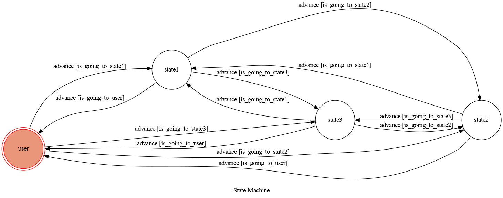

# TOC Project 2022
enviroment : Ubuntu 22.04

## Setup

### Prerequisite
* Python 3.10
* Pipenv
* HTTPS Server

#### Install Dependency
```sh
pip3 install pipenv

pipenv --three

pipenv install

pipenv shell
```

* pygraphviz (For visualizing Finite State Machine)
    * [Setup pygraphviz on Ubuntu](http://www.jianshu.com/p/a3da7ecc5303)
	* [Note: macOS Install error](https://github.com/pygraphviz/pygraphviz/issues/100)


#### Secret Data
You should generate a `.env` file to set Environment Variables refer to our `.env.sample`.
`LINE_CHANNEL_SECRET` and `LINE_CHANNEL_ACCESS_TOKEN` **MUST** be set to proper values.
`SPOTIPY_CLIENT_ID` and `SPOTIPY_CLIENT_SECRET` **MUST** be set to proper values.
Otherwise, you might not be able to run your code.

#### Run Locally
You can either setup https server or using `ngrok` as a proxy.

#### a. Ngrok installation
* [ macOS, Windows, Linux](https://ngrok.com/download)

or you can use Homebrew (MAC)
```sh
brew cask install ngrok
```

**`ngrok` would be used in the following instruction**

```sh
ngrok http 8000
```

After that, `ngrok` would generate a https URL.

#### Run the sever

```sh
python3 app.py
```

## Finite State Machine


## Usage
The initial state is set to `user`.

* transition
	* Input: "search" or "track"
		* dest : state1
		* Reply: search state welcome message

	* Input: "artist"
		* dest : state2
		* Reply: artist state welcome message
	* Input: "Billboard"
		* dest : state3
		* Reply: state3 GUI
	* Input: exit
		* dest : user
		* Reply: user GUI
* state
	* user
		* random song
		* preview
		* next
		* help
	* state1 (search)
		* preview
		* next
		* help
	* state2 (search : artist)
		* top
		* preview
		* next
		* next artist
		* help
	* state3 (billboard)
		* random
		* preview
		* next
		* help